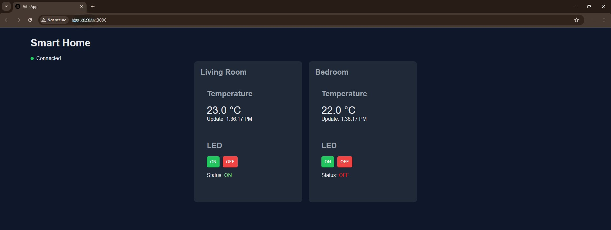
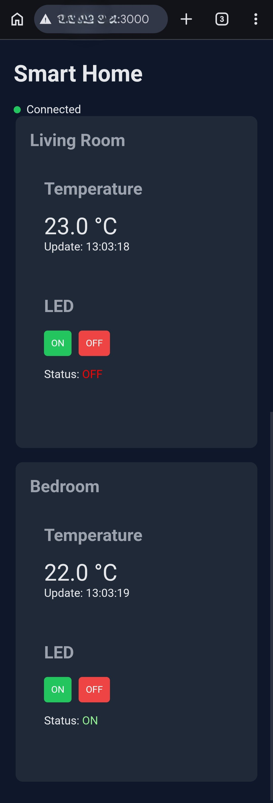

# Smart Home UI

Web interface for a smart home system using MQTT.
Displays temperature and controls LEDs for **two nodes (Living Room & Bedroom)**.

---

## Screenshots

<p align="center">
  
  
</p>

---

## Features

* Two independent nodes:

  * Living Room (Node 1)
  * Bedroom (Node 2)
* Real-time temperature display
* LED control with status feedback
* MQTT over WebSockets

---

## Requirements

* Node.js (>= 18 recommended)
* MQTT Broker (e.g. Mosquitto)
* Browser (Chrome, Edge, etc.)

Optional (for serving production build):

* `serve` (via npm or npx)

---

## Install

```bash
npm install
```

---

## Build

```bash
npm run build
```

---

## Preview Build

### Option 1 (recommended)

```bash
npm run preview -- --host
```

### Option 2 (serve static build)

Without installation:

```bash
npx serve -l 3000 dist
```

Or install globally:

```bash
npm install -g serve
serve -l 3000 dist
```

---

## MQTT Configuration

Broker must support WebSockets:

```
listener 9001
protocol websockets
```

---

## MQTT Topics

### Node 1 (Living Room)

* `home/temperature1` → temperature value (e.g. 22.0)
* `home/led1/status` → ON / OFF
* `home/led1/set` ← ON / OFF

### Node 2 (Bedroom)

* `home/temperature2` → temperature value
* `home/led2/status` → ON / OFF
* `home/led2/set` ← ON / OFF

---

## Network Setup

* The UI is accessed via: http://UI-IP:3000
* MQTT must always connect to the Broker IP: ws://BROKER-IP:9001

---

## Notes

* Replace `UI-IP` with the IP of your UI device
* Replace `BROKER-IP` with the IP of your MQTT broker
* All devices must be in the same network
* Ensure ports 9001 and 3000 are open
